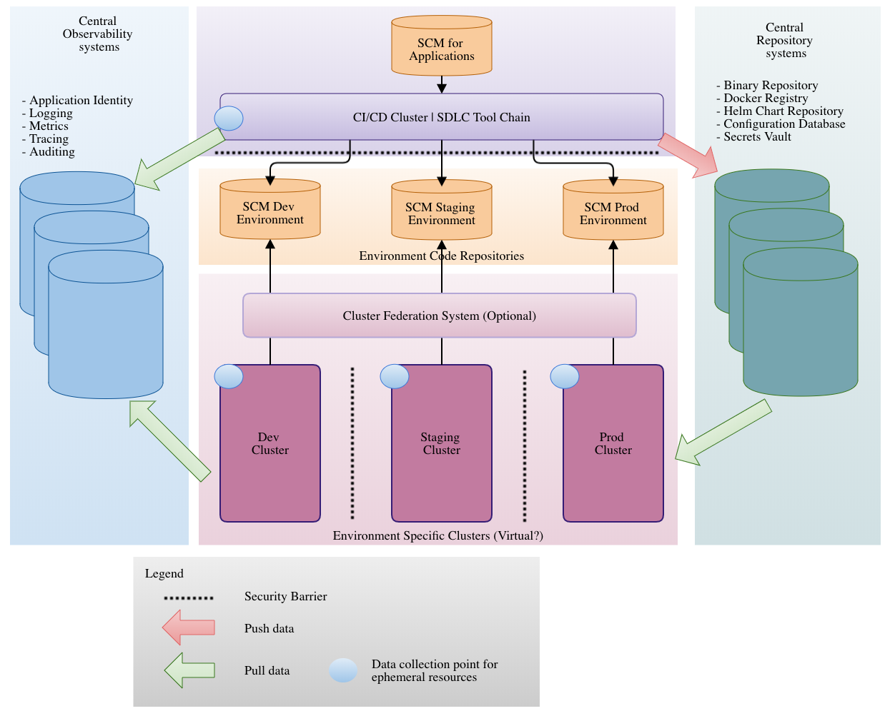

# The Next Chapter In The SDLC Tool Chain Evolution

Before we take a look at Jenkins X, let us briefly dive into the (recent) history of building and deploying software.

## Evolution of SDLC

For the sake of brevity, we will not go all the way back to writing software on punch cards. We start at the advent of Jenkins, rising to prominence in the late 00s as the Hudson, the build server of choice within the Java community.

It solved a growing need for a reliable, consistent and programmable way of building and testing software. In many organizations, it formed the heart of an emerging system, the Software Development LifeCycle toolchain.

As software started eating the world, companies began to rely on this toolchain for more and more of their core business success. As the reliance grew, so did the dependence on this toolchain to provide more information than "build green" or "build red".

To accommodate this need for more information, the number of tools in the toolchain grew. Test tools, static code analysis, security testing, lint tools and more. When the quality of the code can be measured and confirmed, the next step is to deploy it. The more the first was automated, the focus shifted to the latter - deployment - and many organizations adopted CI/CD (Continuous Integration, Continuous Delivery).

When adopting CI/CD, the race was on for delivering more software faster than ever before, including more people - tools related to collaboration sprouted like mushrooms to accommodate this. The demand on the software increased with the number of people and speed of delivery. To combat this, some opted for High Availability, others - such as Git - chose for Decentralization. 

## New Challenges

The rapid increase in the number of tools, the number of people working on software and the increasing need for collaboration created several essential challenges.

1. scale the toolchain to fit demand
1. track all the changes going on within the SDLC toolchain
1. simplify deployment across platforms/languages/frameworks
1. include infrastructure/platform in the CI cycle of the application
1. every tool must be automatable from scratch with either an API or (preferred) declarative configuration
1. only take resources when being used (ScaleToZero)
1. can define workflow from beginning to end (programmable/declarative definition)
1. allows the creation of opinionated workflows that allows overrides and enables extensions
1. can recreate the environment from a source definition
1. will enable you to get started right away with delivering applications

These are critical challenges to be met by any SDLC toolchain. And as we will see, Jenkins X can help you tackle most if not all of them with great ease.

## Anatomy Of The New Chain

Look below of the anatomy of the new SDLC toolchain.

We'll dissect the model into a few parts. Mind you, while tools might intersect, the idea is to look at the SDLC. So "data" refers to the data produced by the SDLC, not by the applications themselves.

* **Workflow**: how does a change in SCM end up as it intended effect in the correct environment
* **Information**: we need continuous information about the state of our SDLC toolchain and application landscape. Monitoring, logging, auditing, etc.
* **Data**:  we need to permanently - or at least for an X amount of time - artifact generated within the SDLC. Docker images, Java Jar's, Helm Charts, etc.
* **Environments**: we will manage environments via the SDLC as well. With the advent of GitOps, this will be done via X as Code via our Git repository.

### Expectation table

| Component    	| Runtime Type 	| Storage Type 	| Sizing               	|
|--------------	|--------------	|--------------	|----------------------	|
| Workflow     	| Event Based  	| Ephemeral    	| Autoscale            	|
| Information  	| Permanent    	| Temporary    	| Autoscale            	|
| Data         	| Event Based  	| Permanent    	| Autoscale            	|
| Environments 	| Permanent    	| Permanent    	| Predictive Autoscale 	|

### GitOps Model

