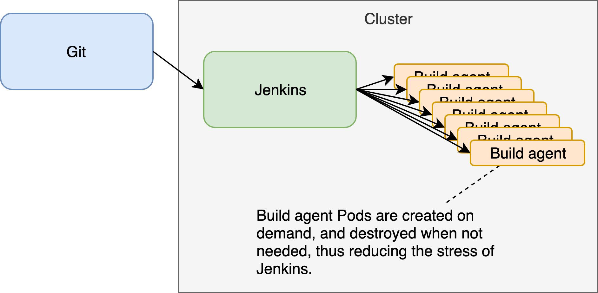
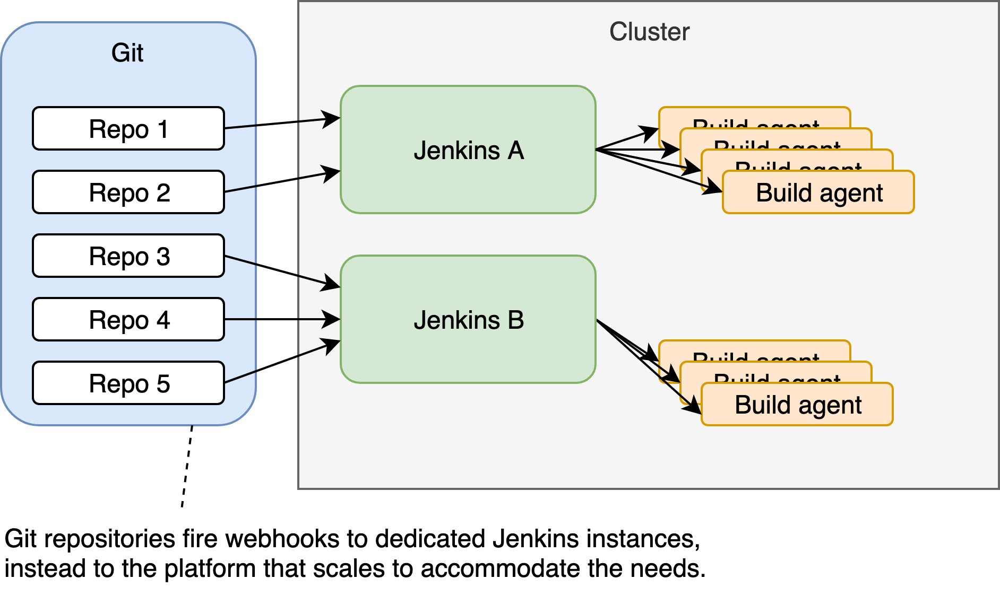
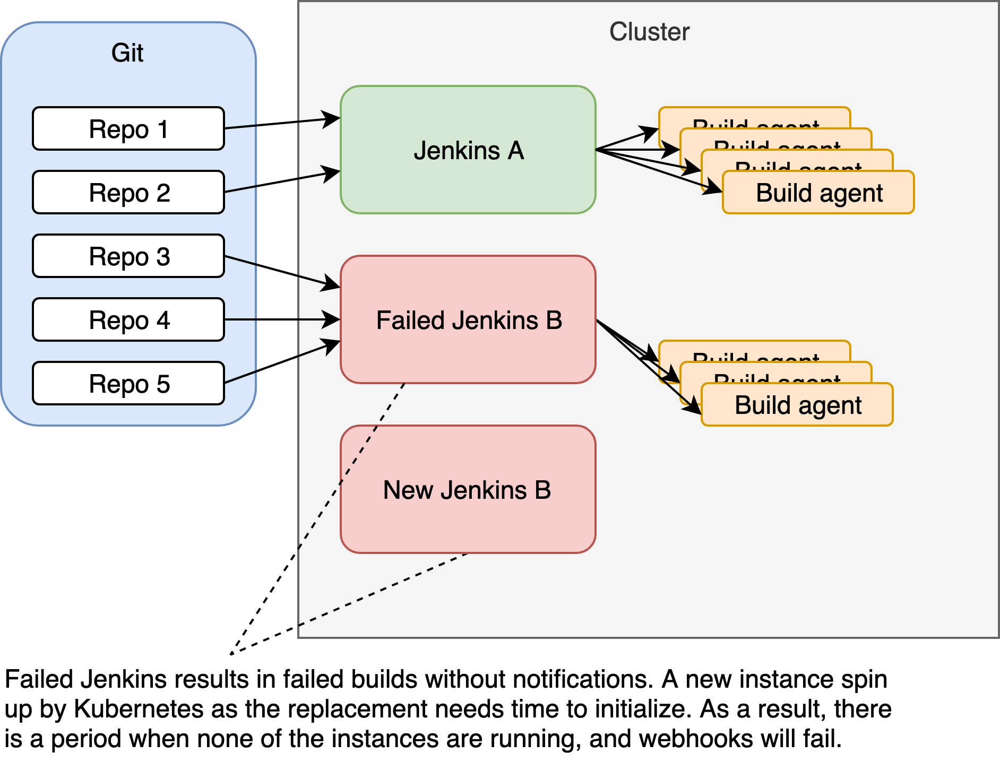

# Going Serverless

We saw that Jenkins X packs a lot of useful tools and processes and that it is very different from the "traditional" Jenkins. Serverless Jenkins X solves many problems we had with Jenkins used in the static flavor. Jenkins does not scale. If we need more power because the number of concurrent builds increased, we cannot scale Jenkins. We cannot hook it into Kubernetes HorizontalPodAutoscaler that would increase or decrease the number of replicas based on metrics like the number of concurrent builds.

Simply put, Jenkins does not scale. At times, our Jenkins is struggling under heavy load. At others, it is wasting resources when it is underutilized. As a result, we might need to increase its requested memory and CPU as well as its limits to cover the worst-case scenario. As a result, when fewer builds are running in parallel, it is wasting resources, and when more builds are running, it is slow due to insufficient amount of assigned resources. And if it reaches its memory limit, it'll be shut down and rerun (potentially on a different node), thus causing delays or failed builds.

Truth be told, the need to scale Jenkins is smaller than for many other tools, since a significant part of the workload is delegated to agents which, in our case, are running inside disposable one-shot Pods. However, even though most of the tasks are executed inside agents, sooner or later you will reach the limits of what a single Jenkins can do without affecting performance and stability. That is, assuming that your workload is big enough. If you're having only a few projects and a limited number of concurrent builds, a single Jenkins will satisfy most of your needs.

The only way we can prevent Jenkins from being overloaded is either to increase its memory and CPU or to create new instances. However, creating new instances does not produce the same results as scaling. If we define scaling as an increase (or a decrease) of the number of replicas of a single instance, having multiple replicas means that the load is shared across them. Since that is not possible with Jenkins, we need to increase the number of instances. That means that we cannot have all our pipelines defined in a single Jenkins, but that we can create different instances, each hosting different sets of pipelines.

While it's true that we can accomplish resemblance of scaling by spinning multiple Jenkins instances, that does not tackle the problem of high availability. If every Jenkins instance runs only a single replica, what happens when it fails? The good news is that Kubernetes takes care of rerunning failed instances. The bad news is that a failure of a single-replica application inevitably produces downtime. The period from the moment an instance fails until it is recreated by Kubernetes and the processes inside it are fully operational is the period when Jenkins is not available. Whether that is a couple of seconds or a few minutes does not change the fact that it does not always work. No single-replica application can guarantee high-availability in modern terms (e.g., 99.999% availability).

What is the real problem if we do not have Jenkins available all the time? Do we care if every once in a while it stops working for a few minutes? The answer to those questions depends primarily on you. If you are a small company, a few minutes of unavailability that affects only developers (not the end-users) is often not a big deal. But, the real issues are coming from a different direction. What happens when we push code to Git which, in turn, triggers a webhook request? If there is no one to receive that request (e.g., Jenkins is down), no one will even know that a build was not triggered. We could be living in oblivion thinking that everything went fine and that a new release passed all validations and was deployed to staging or even production. When Jenkins fails, all the builds that were running at that time will fail as well. That's not a problem by itself since builds can fail for a variety of other reasons (e.g., a bug that results in a failed test). The issue is that we are notified of failed builds only when Jenkins is running. If it goes down (ungracefully), a build will stop abruptly, and the step that is supposed to notify us will never be executed. Nevertheless, if you are small to medium size company, avoiding those problems might be more expensive than the cost of fixing them, unless the solution is already available out of the box.

What can we do when faced with two options, and none of them are acceptable? We can come up with a third one. If Jenkins cannot scale, and the only way to share the load is by splitting the pipelines across multiple instances, then maybe we can go to the other extreme and dedicate a Jenkins instance to each build. All we'd have to do is create a highly available API that would accept incoming webhooks, and let it spin up a new Jenkins instance for each build. That could not be a generic Jenkins, but a customized one that would contain not only the engine but all the tools that a build needs. It would need to be something similar to a combination of a Jenkins master and a pipeline specific agent.

But that poses a few new challenges. First of all, what should we use as a highly available API? How will it spin up new Jenkins instances that contain pipeline-specific tools? Will it be fast enough? Is Jenkins designed to work like that, or should we use something else? The answer to those questions requires a more in-depth analysis. For now, what matters is that Jenkins X solved those problems. There is now a highly available API that accepts webhook requests. There is a mechanism that will translate your pipelines into a set of tasks that are created and run on-demand, and destroyed when finished.

If we spin up pipeline-runners on demand and we destroy them when builds are finished, we can say that we'd get a serverless solution. Each request from a webhook would result in one or more new processes that would run all the steps defined in a pipeline. As long as the API that accepts webhook requests is highly available and knows how to spin up and destroy processes required for each pipeline build, we should have a highly-available and fault-tolerant solution that uses only the resources it needs.

I> I really dislike the word "serverless" because it is misleading. It makes you believe that there are no servers involved. It should rather be called servers-not-managed-by-us. Nevertheless, I will continue using the word serverless to describe processes that spin up on demand and get destroyed when done, simply because that is the most commonly used name today.

Jenkins X in serverless mode uses [Prow](https://github.com/kubernetes/test-infra/tree/master/prow) as the highly available API that receives webhook requests. Jenkins is replaced with Jenkins X Pipeline Operator and [Tekton](https://cloud.google.com/tekton/). It translates the events coming to Prow into Tekton pipelines. Given that Tekton is very low-level and its pipelines are hard to define, Pipeline operator translates Jenkins pipelines into Tekton Pipelines which, in turn, spin up Tekton Tasks, one for each step of the pipeline. Those pipelines are defined in jenkins-x.yml.

One of the things you'll notice is that there is no Jenkins in that diagram. It's gone or, to be more precise, replaced with other components, more suitable for today's challenges. But, introducing entirely new components poses a new set of challenges, especially for those already experienced with Jenkins.

Learning that new components like Prow, Pipeline Operator, and Tekton might make you feel uncomfortable unless you already used them. If that's the case, you can rest at ease. Jenkins X makes their usage transparent. You can go deep into their inner workings, or just ignore their existence since Jenkins X does all the heavy lifting and integration between them.

What matters is that serverless Jenkins X is here and it brings a whole new set of opportunities and advantages compared to other solutions. It is the first continuous delivery solution designed specifically for Kubernetes. It is cloud-native and based on serverless principles, and it is fault-tolerant and highly-available. It scales to meet any demand, and it does not waste resources. And all that is done in a way transparent to the user and without the need to spend eternity trying to figure out how to assemble all the pieces of a very complex machine.

In this chapter, we will explore how to increase the number of Jenkins instances, as well as how to transition into a serverless solution. By understanding both options (multi-instance Jenkins, and serverless on-demand pipelines), you should be able to make a decision which direction to take.

## Exploring Prow, Jenkins X Pipeline Operator, And Tekton

The serverless flavor of Jenkins X or, as some call it, Jenkins X Next Generation, is an attempt to redefine how we do continuous delivery and GitOps inside Kubernetes clusters. It does that by combining quite a few tools into a single easy-to-use bundle. As a result, most people will not have a need to understand intricacies of how the pieces work independently, nor how they are all integrated. Instead, many will merely push a change to Git and let the system do the rest. But, there are always those who would like to know what's happening behind the hood. To satisfy those craving for insight, we'll explore the processes and the components involved in the serverless Jenkins X platform. Understanding the flow of an event initiated by a Git webhook will give us insight into how the solution works and help us later on when we go deeper into each of the new components.

I> The description that follows might be too much for some people. I will not think less of you if you choose to skip it and enjoy using serverless Jenkins X without knowing its inner workings. After all, the main objective of Jenkins X is to abstract the details and let people practice continuous delivery without spending months trying to learn the intricacies of complex systems like Kubernetes and Jenkins X.

Everything starts with a push to a Git repository which, in turn, sends a webhook request to the cluster. Where things differ is that there is no Jenkins to accept those requests. Instead, we have [Prow](https://github.com/kubernetes/test-infra/tree/master/prow). It does quite a few things but, in the context of webhooks, its job is to receive requests and decide what to do next. Those requests are not limited only to push events, but also include slash commands (e.g., `/approve`) we can specify through pull request comments.

Prow consists of a few distinct components (e.g., Deck, Hook, Crier, Tide, and a few more). However, we won't go into the roles of each of them just yet. For now, the vital thing to note is that Prow is the entry point to the cluster. It receives Git requests generated either by Git actions (e.g., `push`) or through slash commands in comments.

Prow might do quite a few things upon receiving a request. If it comes from a command from a Git comment, it might re-run tests, merge a pull request, assign a person, or one of the many other Git related actions. If a webhook informs it that a new push was made, it will send a request to the Jenkins X Pipeline Operator which will make sure that a build corresponding to a defined pipeline is run. Finally, Prow also reports the status of a build back to Git.

Those features are not the only types of actions Prow might perform but, for now, you probably got the general Gist. Prow is in charge of communication between Git and the processes inside our cluster.

When a Prow Hook receives a request from a Git webhook, it forwards it to Jenkins X Pipeline Operator. The role of the operator is to fetch jenkins-x.yml file from the repository that initiated the process and to transform it into Tekton Tasks and Pipelines. They, in turn, define the complete pipeline that should be executed as a result of pushing a change to Git.

The reason for the existence of the Pipeline Operator is to simplify definitions of our continuous delivery processes. Tekton does the heavy lifting, but it is a very low-level solution. It is not meant to be used directly. Writing Tekton definitions can be quite painful and complicated. Pipeline Operator simplifies that through easy to learn and use YAML format for defining pipelines.

Tekton creates a PipelineRun for each build initiated by each push to one of the associated branches (e.g., `master` branch, PRs, etc.). It performs all the steps we need to validate a push. It runs tests, stores binaries in registries (e.g., Docker Registry, Nexus, and ChartMuseum), and it deploys a release to a temporary (PR) or a permanent (staging or production) environment.

The complete flow can be seen in the diagram 11-9.

I> You might notice the same diagram in [jenkins-x.io](https://jenkins-x.io/architecture/diagram/). The community thought that it is useful, so I contributed it.

As I already mentioned, not everyone needs to understand the flow of events nor to have a deep understanding of all the components involved in the process. For most users, the only important thing to understand is that pushing changes to Git will result in the execution of the builds defined in jenkins-x.yml pipeline. That's the beauty of Jenkins X. It simplifies our lives by making complicated processes simple.

If, on the other hand, you are interested in details, we will cover each of the components in more details in the next chapters.
